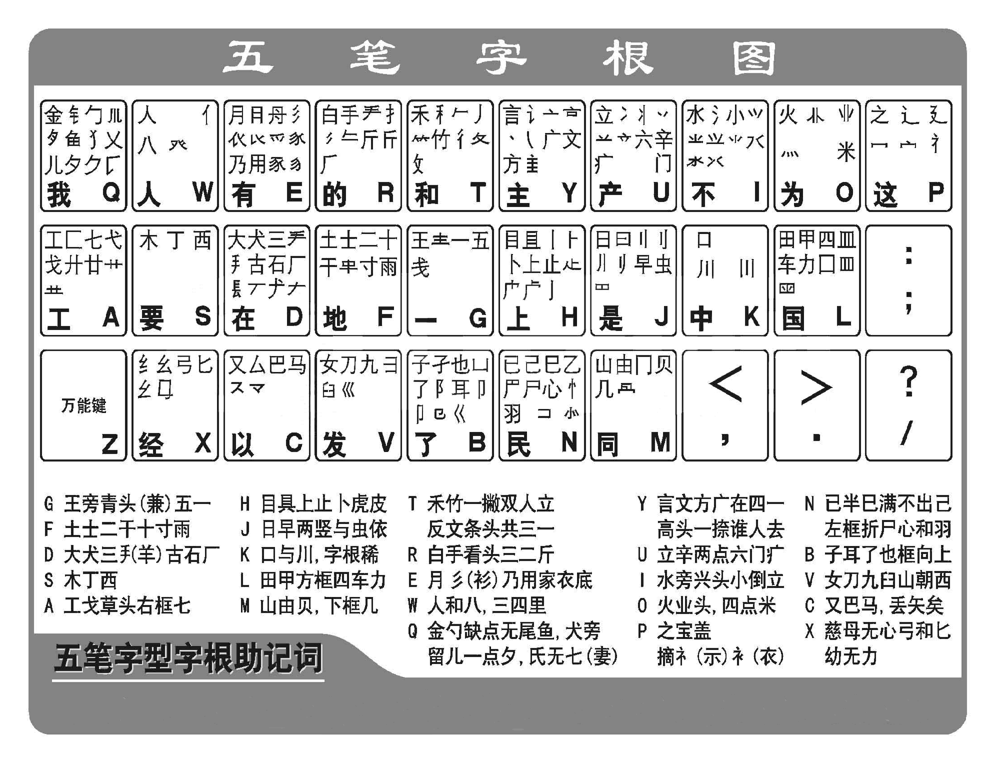

# README

混淆字

- [ ] “自己”的“己”`NNGN`
- [ ] “已经”的“已”`NNNN`
- [ ] “甲乙”的“乙”`NNLL`

差不多的

- [ ] 豕（shǐ）`EGTY`，意思为“猪”。
- [ ] 豚（tún）`EEY`
- [ ] “涿州”的“涿”`IEYY`

- [ ] “拨动”的“拨”`RNTY`
- [ ] “跋山涉水”的“跋”`KHDC`

右侧带“戈”矛

- [ ] “时间戳”的“戳”`NWYA`
- [ ] “截取”的“截”`FAWY`
- [ ] “记载”的“载”`FALK`

左侧是“十早”

- [ ] “翰林”的“翰”`FJWN`
- [ ] “韩国”的“韩”`FJFH`
- [ ] “朝阳”的“朝”`FJEG`

分清“月”与“具”

- [ ] “县城”的“县”`EGCU`
- [ ] “具体”的“具”`HWU`

- [ ] “降落”的“降”`BTAH`
- [ ] “绛”`XTAH`，读音jiàng，表示赤色，火红。

比较难拆的字

- [ ] “羽毛”的“羽”`NNYG`
- [ ] “戒律”的“戒”`AAK`
- [ ] “涿州”的“州”`YTYH`
- [ ] “爵位”的“爵”`ELVF`
- [ ] “勤奋”的“勤”`AKGL`
- [ ] “赘述”的“赘”`GQTM`
- [ ] “斧凿”的“凿”`OGUB`
- [ ] “套路”的“套”`DDU`
- [ ] “城墙”的“墙”`FFUK`
- [ ] “茂盛”的“茂”`ADNT`和“盛”`DNNL`
- [ ] “瓦片”的“瓦”`GNYN`

看着简单，但不好写的单字

- [ ] “艺术”的“艺”`ANB`，难点在于最后一个`B`
- [ ] “牙齿”的“牙”`AHTE`，难点在于把“牙”字拆分成3个部分，最后一个`E`是表示结构的。扩展：穿`PWAT`。
- [ ] “牙齿”的“齿”`HWBJ`，难点在于`B`，它是一个向上的框，还有就是`J`表示上下结构。扩展：龌龊`HWHW`。
- [ ] “鱼贯而入”的“贯”`XFMU`，难点在于前两个字母`XF`，其中`X`表示“母”的外框 ，而`F`表示里面的“十”字。扩展：习惯`NUNX`。
- [ ] “亟待解决”的“亟”`BKCG`，难点在于不明白拆分的结构，明白了结构就好说了。
- [ ] “曹操”的“曹”`GMAJ`，难点在于不知道怎么拆分。

词语

- [ ] 礼貌`PYEE`

笔画有点多的字

- [ ] “厨房”的“厨”`DGKF`
- [ ] “嘉奖”的“嘉”`FKUK`

单个键的字

- [ ] 豕（shǐ），更易用“豚”
- [ ] 川流不息的“川”`KTHH`
- [ ] “器皿”的“皿”`LHNG`
- [ ] “枕戈待旦”的“戈”`AGNT`
- [ ] “早晨”的“早”`JHNH`

## 天干地支

- 十天干：甲`LHNH`、乙`NNLL`、丙`GMWI`、丁`SGH`、戊`DNYT`、己`NNGN`、庚`YVWI`、辛`UYGH`、壬`TFD`、癸`WGDU`
- 十二地支：子`BBBB`、丑`NFD`、寅`PGMW`、卯`QTBH`、辰`DFEI`、巳`NNGN`、午`TFJ`、未`FII`、申`JHK`、酉`SGD`、戌`DGNT`、亥`YNTW`
