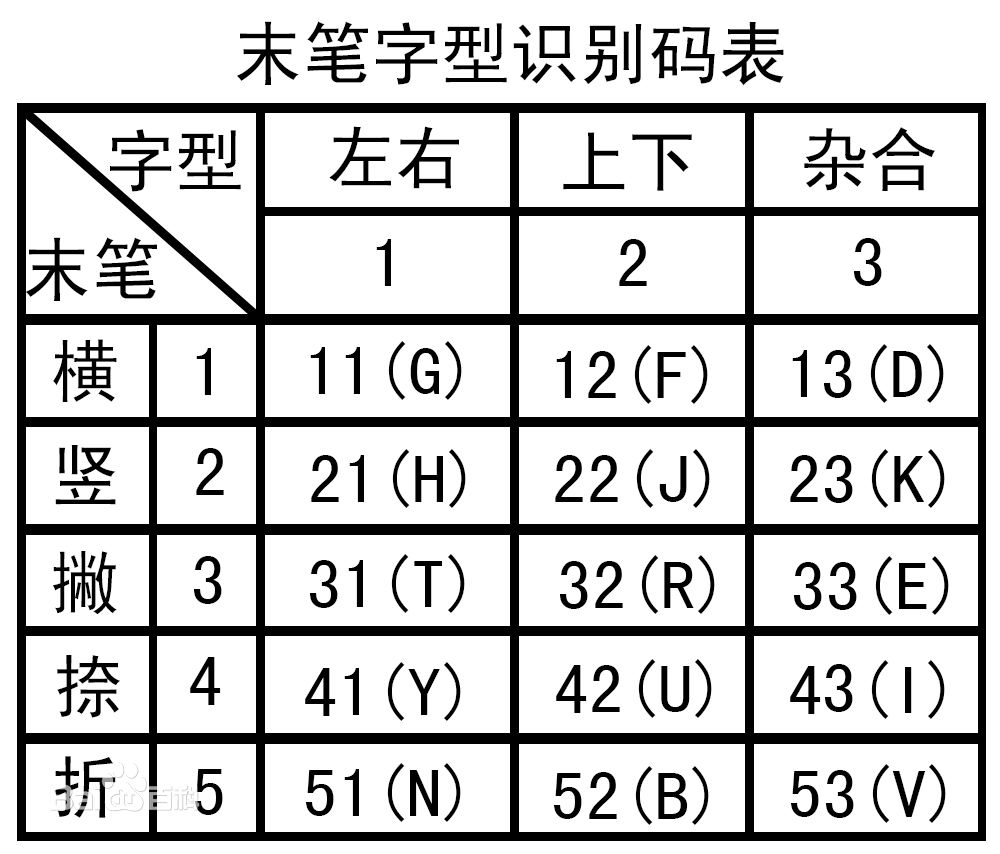

# 五笔

<!-- TOC -->

- [1. 何为五笔](#1-%E4%BD%95%E4%B8%BA%E4%BA%94%E7%AC%94)
- [2. 五笔分级](#2-%E4%BA%94%E7%AC%94%E5%88%86%E7%BA%A7)
- [3. 编码规律](#3-%E7%BC%96%E7%A0%81%E8%A7%84%E5%BE%8B)
  - [3.1. 单笔画](#31-%E5%8D%95%E7%AC%94%E7%94%BB)
  - [3.2. 单字](#32-%E5%8D%95%E5%AD%97)
  - [3.3. 词组打法](#33-%E8%AF%8D%E7%BB%84%E6%89%93%E6%B3%95)
- [4. 识别码](#4-%E8%AF%86%E5%88%AB%E7%A0%81)
- [5. 打字原则](#5-%E6%89%93%E5%AD%97%E5%8E%9F%E5%88%99)
- [6. 偏旁部首](#6-%E5%81%8F%E6%97%81%E9%83%A8%E9%A6%96)
  - [6.1. 左](#61-%E5%B7%A6)
  - [6.2. 右](#62-%E5%8F%B3)
  - [6.3. 上](#63-%E4%B8%8A)
  - [6.4. 下](#64-%E4%B8%8B)

<!-- /TOC -->

## 1. 何为五笔

所谓“五笔”，是指五个笔划，即“一丨丿丶乙 (横竖撇捺折)”

## 2. 五笔分级

五笔分为四级：要用五笔打出一个字或一个词，最多需要四个字母。

- 一级简码：一个字母一个字。五笔定义使用最频繁的二十五个汉字。例：一地在要工 上是中国同 和的有人我 主产不为这 民了发以经
- 二级简码：两个字母一个字
- 三级简码：三个字母一个字。
- 四级？那叫全码！四个字母一个字。

## 3. 编码规律

- 单笔画：1个字，一笔画
- 单字：1个字，多笔画
- 词组打法
  - 2个字的词组
  - 3个字的词组
  - 4个字的词组
  - 超过4个字的词组

### 3.1. 单笔画

单笔画：横竖撇捺折的打法，这几个笔划的编码方法是固定的，不用问为什么。

- 一：`GGLL`
- 丨：`HHLL`
- 丿：`TTLL`
- 丶：`YYLL`
- 乙：`NNLL`

### 3.2. 单字

口诀

- 键名不拆打四下，（键名：X键除外，每键口诀的第一个字，X键为纟）
- 成报一二末笔画；（成：除键名和单笔画外的键面字根；报：字根所在键按一下）
- 一般一二三末根，（一般：拆分四码或四码以上的汉字）
- 不足才补识别码。 （不足：拆分不足四码的汉字）

> 注意：需要区分清两个概念：“键名”字和“键内”字。

口诀解释：

- 第一句解释。“键名”字的打法：重复按那个键名字的所在键4下。例：“金”字的打法：『QQQQ』。

- 第二句解释。“键内”字（除键名和单笔画外的键面字根，）打法：字根所在键+第一笔画+第二笔画+末笔画。例：“早”字的打法：『 日J + 丨H + 乙N + 丨H 』。“灬”字的打法：『 灬O+ 丶Y + 丶Y + 丶Y』。

> 注意：并不是所有的键面字根都可以打出来的。

- 第三句解释。一般汉字（按拆分规律拆分四码或四码以上的汉字）的打法：该汉字的第一个字根+第二个字根+第三个字根+最后的字根。例：“幕”字的打法：『 艹A + 日J + 大D + 丨H = AJDH 』。

- 第四句解释。拆分不足四码的汉字打法：该汉字的第一个字根+该汉字的第二个字根+该汉字的第三个字根（没有第三个字根的不取）+识别码。例：“云”字的打法：『 二F + 厶C + 识别码U 』。

### 3.3. 词组打法

- 两字：每字各取前两字根2+2，
- 三字：前两字取首字根第三字取第一二字根1+1+2，
- 四字：各取每字的第一字根1+1+1+1，
- 超四字：前三字和末字取首字根1+1+1+末1。

解释：

- 两个字的打法：第一个字的第1个字根+第一个字的第2个字根+第二个字的第1个字根+第二个字的第2个字根。例：“百科”一词的打法：『 百DJ + 科TU = DJTU 』
- 三个字的打法：第一个字的第1个字根+第二个字的第1个字根+第三个字的第1个字根+第三个字的第2个字根。例：“龙井茶”一词的打法：『 龙D + 井F + 茶A+ 人W = DFAW』
- 四个字的打法：第一个字的第1个字根+第二个字的第1个字根+第三个字的第1个字根+第四个字的第1个字根。例：“春暖花开”一词的打法：『 春D + 暖J + 花A+ 开G = DJAG 』
- 超四字词的打法：第一个字的第1个字根+第二个字的第1个字根+第三个字的第1个字根+最后字的第1个字根。例：“中华人民共和国”几个字的打法：『 中K + 华W + 人W + 国L = KWWL 』

## 4. 识别码

识别码：在五笔输入法中用于区分重码字（拆分不足四码的汉字）末笔笔划和字型结构的代码。
其作用是：减少重码，提高录入速度。

关于末笔：

为了使识别码有足够的区分能力，除带有偏旁“廴辶”的杂合结构汉字的末笔是指被包围的部分（仅适用于杂合结构），除此以外末笔是指该汉字最后字根的末笔。例：

- “廹”的末笔是（横）；“辽”的末笔是（竖）；
- “涟”的末笔是（捺）；“莲”的末笔是（捺）；
- “载”的末笔是（竖）；“因”的末笔是（捺）。

字型结构（分为三种）：

- 左右结构（包括左中右结构）
- 上下结构（包括上中下结构）
- 杂合结构（其余为杂合结构）

字型口诀：

- 左右型1上下2，交叉独体包围3 。
- 两或三根才需要，单根成字勿劳神！

末笔识别码口诀：

- 末笔是谁在谁区，再看字形代号几；
- 由此生成区位码，指向哪里是哪里。

五笔字根识别码：拆完字根还打不出来加识别码键,同理复杂的字取前三个字根加最后一笔

- （1）、末笔为“一”
  - 左右型的汉字，末笔字型识别码为：G。
  - 上下型的汉字，末笔字型识别码为F。
  - 杂合型的汉字，末笔字型识别码为D。
- （2）、末笔为“丨”
  - 左右型的汉字，末笔字型识别码为H。
  - 上下型的汉字，末笔字型识别码为J。
  - 杂合型的汉字，末笔字型识别码为K。
- （3）、末笔为“丿”（左右：T、上下:R、杂合：E）
- （4）、末笔为“丶”（左右：Y、上下:U、杂合：I)
- （5）、末笔为“乙”（左右：N、上下：B、杂合：V)

## 5. 打字原则

五笔的打字原则是：能打一个，决不打俩。
这是按键次数说的。就是说能打一个字母出这个字，就不要打两个字母或者打全码，少按一次是一次。这就是速度的秘诀，这与今后打字时你用的不同五笔版本以及经验的不断积累有关。但作为学会五笔的基础，汉字的五笔全码还是要有所了解的，一定要知道全码是什么。比如平时打“我”字只要打一个『Q』和一个空格就出来了，但你一定要知道“我”字全码的打法是『丿T + 扌R + ?]N + T丿 = TRNT』。

## 6. 偏旁部首

### 6.1. 左

- 亻，读音rén，五笔`WTH`，同“人”。用作偏旁。俗称“单人旁”。
- 纟，读音sī，五笔`XXXX`，同“糸”。用作偏旁。俗称“绞丝旁”。
- 饣，读音shí，五笔`QNB`，同“食”。用作偏旁。

### 6.2. 右

### 6.3. 上

- 艹，读音ǎo，五笔`AGHH`，同“草”。用作偏旁。俗称“草头”或“草字头”。
- 癶，读音bō，五笔`WNYT`，表示两足分张相背，行走不顺。

### 6.4. 下

- 灬，读音huǒ，五笔`OYYY`，古同“火”。

