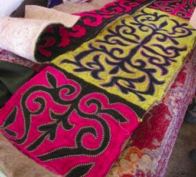
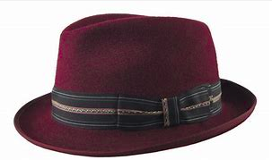
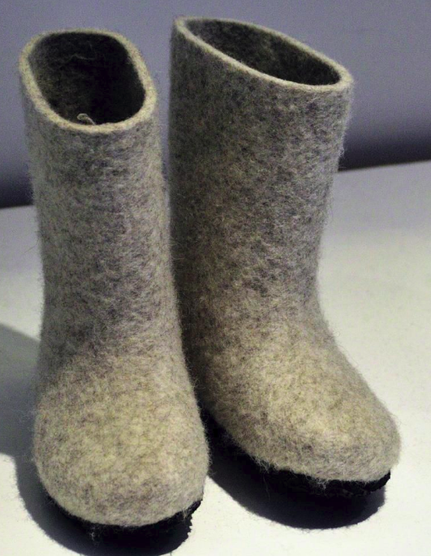

# zhan

## 毡

- 读音：`zhān`
- 五笔：`TFNK`
- 本义：加工羊毛或其他动物毛而成的块片状材料
- 含义：用兽毛或化学纤维制成的片状物，可做防寒用品的垫衬材料。

> 衬垫，填充两个或更多个配合表面之间的空间，作为具有缓冲作用的包装构件，其主要作用是减少或降低外界冲击对内包装物品的破坏。

我的理解就是，“毡”给人一种毛茸茸的感觉，材料是动物的皮毛做成的，形状是“片状”的。

毡子（zhān zǐ），兽毛蹂压而成的厚片状制品，称为毡子，多在我国北方地区使用。

毡帽，用毡制作的帽子。

毡靴，是指我国北部少数民族用毡制成的靴子。主要是羊毛、骆驼毛、牦牛毛等，经湿、热、挤压等物理作用制成片状的无纺织物，具有回弹、吸震、保暖等性能。

